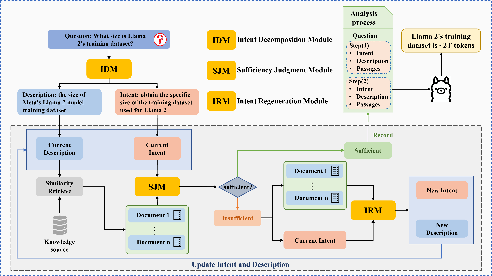

# **IDR-RAG: Enhancing Question Processing via Iterative Intent Decomposition-Regeneration**



## Setup environments

### 1.Install Ollama

Use following code to install ollama and pull LLM:

```
curl -fsSL [https://ollama.com/install.sh](https://ollama.com/install.sh) | sh

ollama pull llama2:13b
```

### 2.Config Enviorment

Use the following code to set up virtual environment:

```
conda create -n idr python=3.10

conda activate idr

pip install -r requirement.txt
```

## Obtain the Retriever
We use  [Contriever-MSMARCO](https://huggingface.co/facebook/contriever-msmarco) as retriever, use the following code to configure the retriever:
### 1.Environment Configuration
First, configure the huggingface_hub to ensure the download environment is set up properly.

```
conda activate idr

pip install huggingface_hub
```

### 2.Retriever download
Second, download the retriever
```
conda activate idr

huggingface-cli download facebook/contriever-msmarco --local-dir ./contriever-msmarco --local-dir-use-symlinks False
```

## Simple Sample Test
You can test the model's output on different individual data points by changing the label indices.
The following code is an example for testing the No. 6 data:
```
conda activate idr

python3 dev.py --idx 6
```